# Laboratory work-1

## Task-1

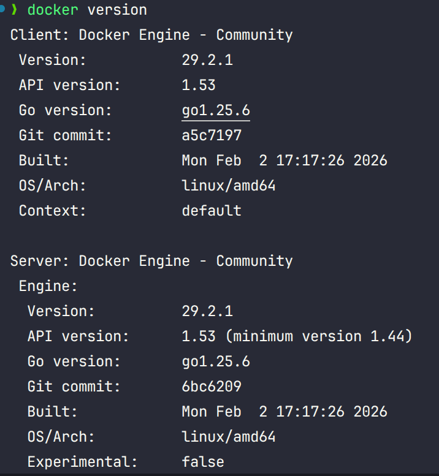

## Task-2

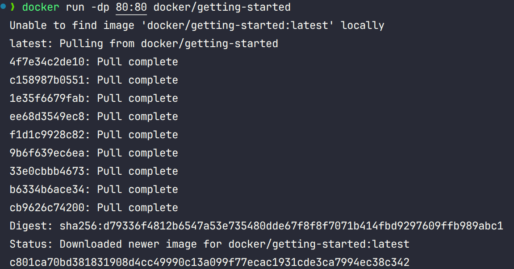
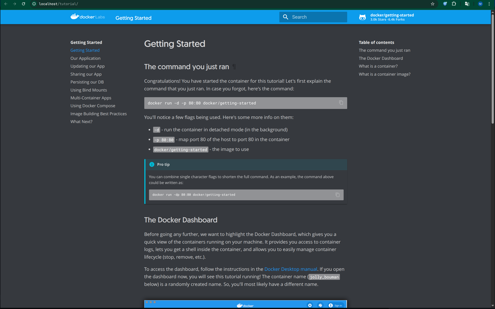

## Task-3
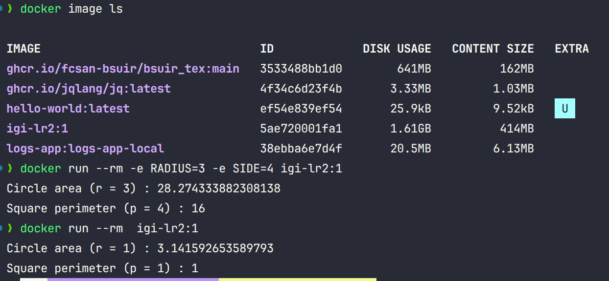

## Task-4
docker compose up -d --build
or docker compose build / docker compose up -d
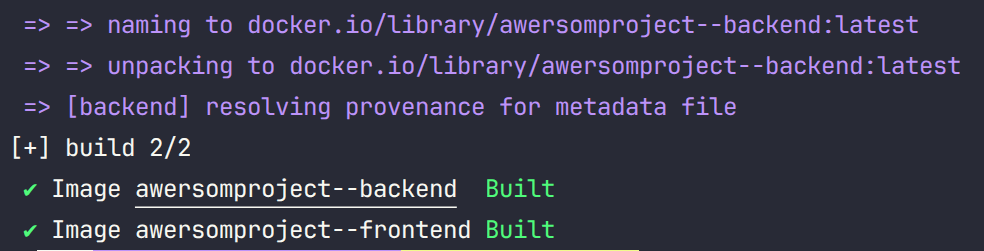

## Task-5

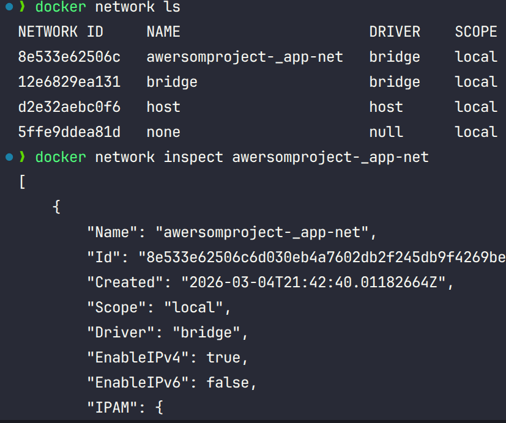
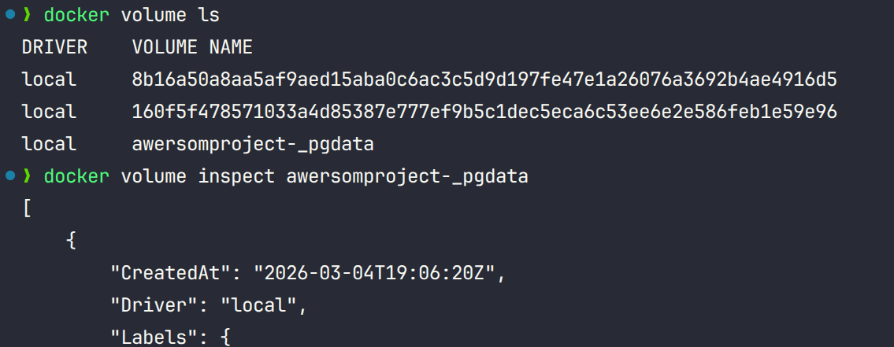

## Task-6

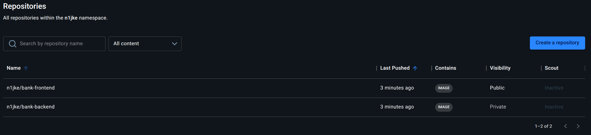

## Task-7
  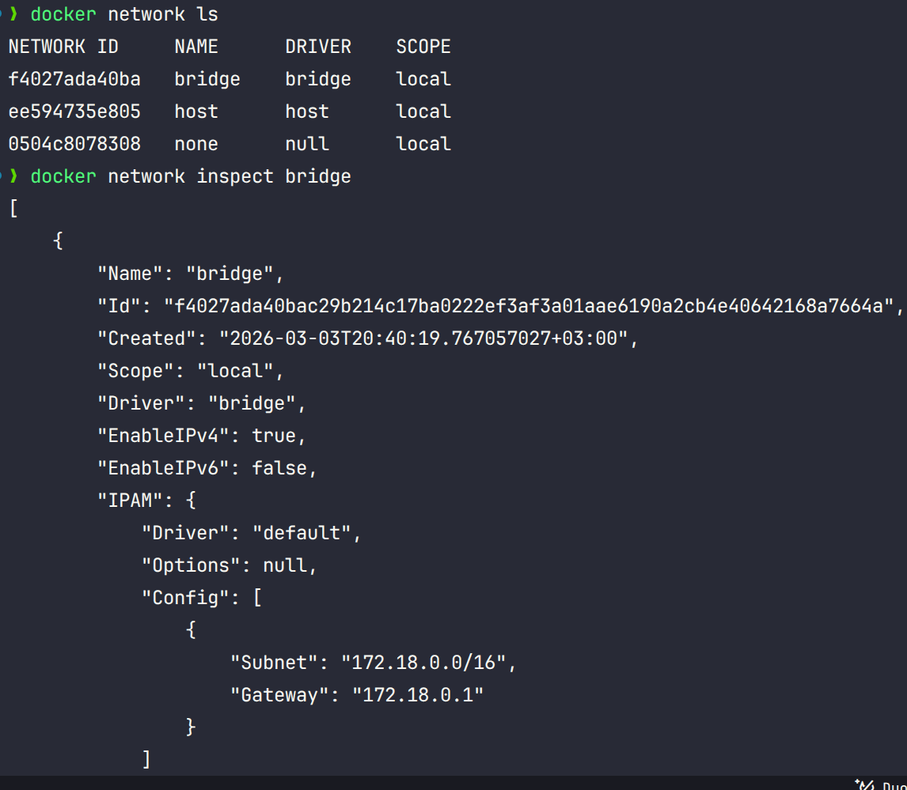

  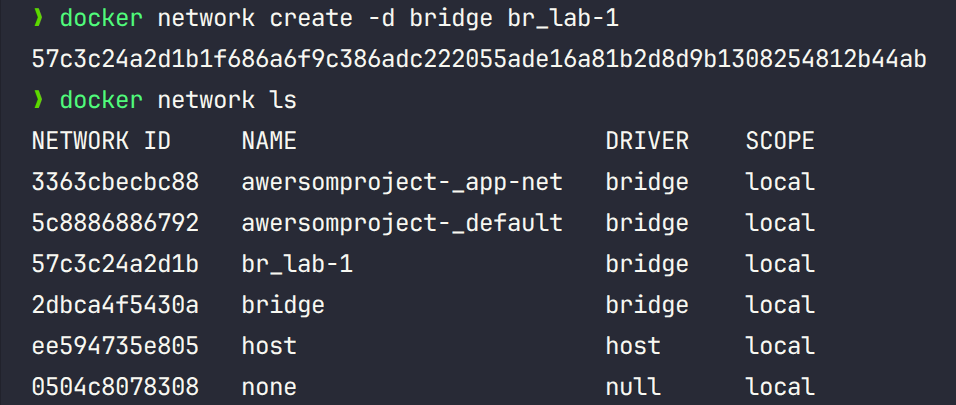

  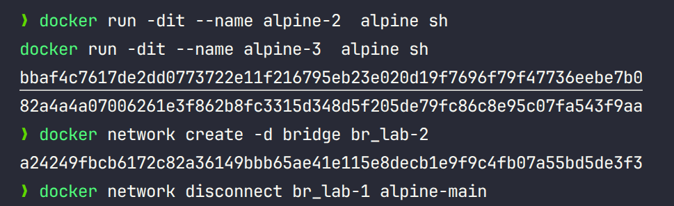

  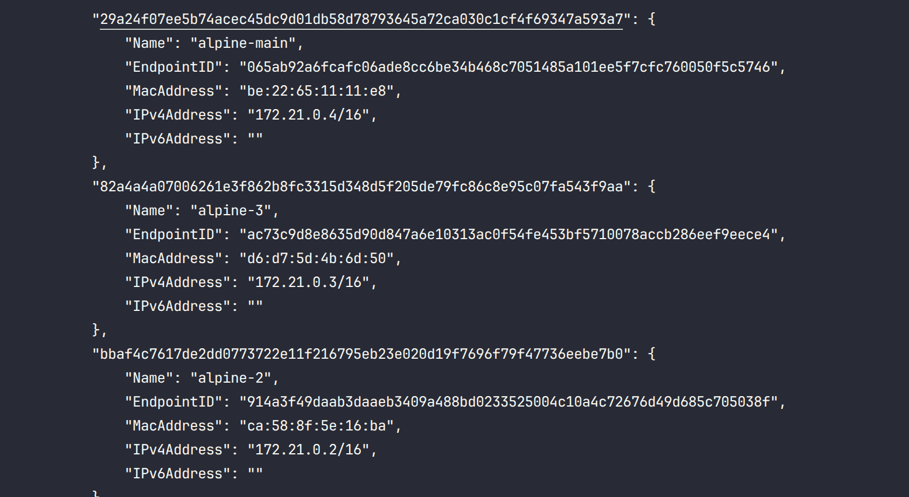

  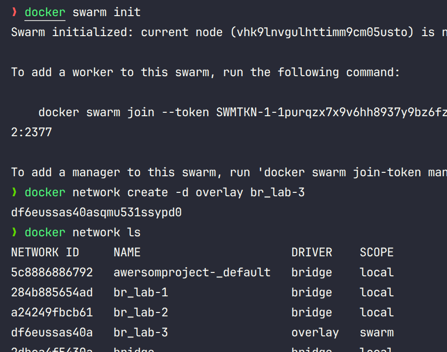

  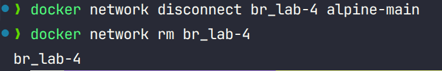