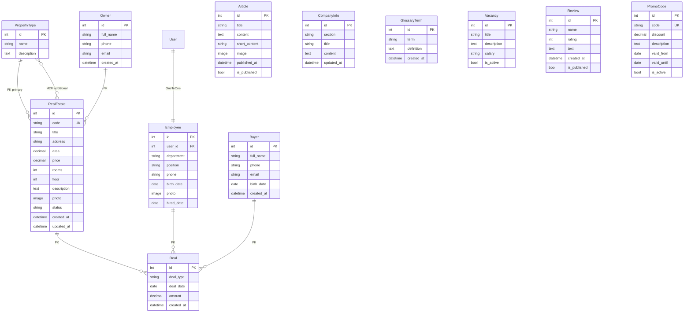

# ER-диаграмма: Агентство недвижимости (вариант 26)

## Типы связей

| Связь | Тип | Описание |
|-------|-----|----------|
| User <-> Employee | OneToOne | Профиль сотрудника |
| PropertyType -> RealEstate | ForeignKey | Основной тип объекта |
| PropertyType <-> RealEstate | ManyToMany | Дополнительные типы |
| Owner -> RealEstate | ForeignKey | Владелец объекта |
| RealEstate -> Deal | ForeignKey | Объект сделки |
| Employee -> Deal | ForeignKey | Оформивший сотрудник |
| Buyer -> Deal | ForeignKey | Покупатель/арендатор |
